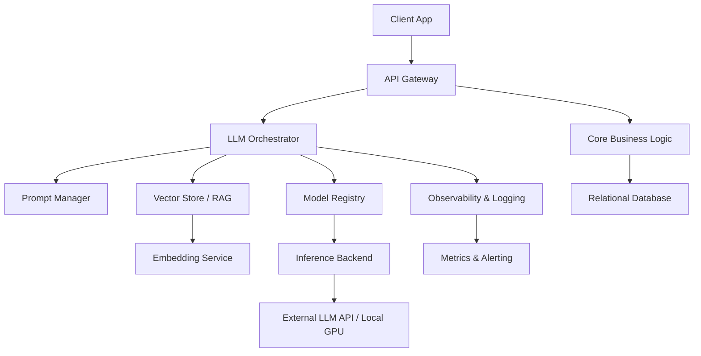
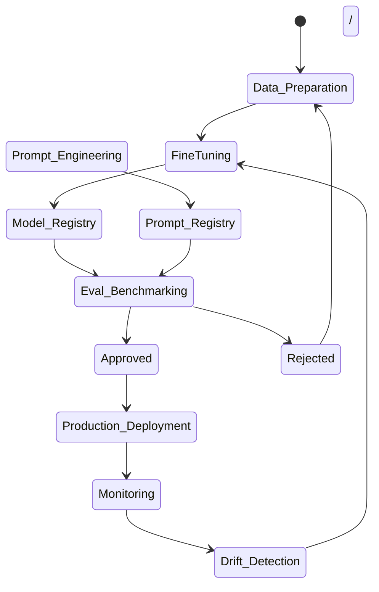
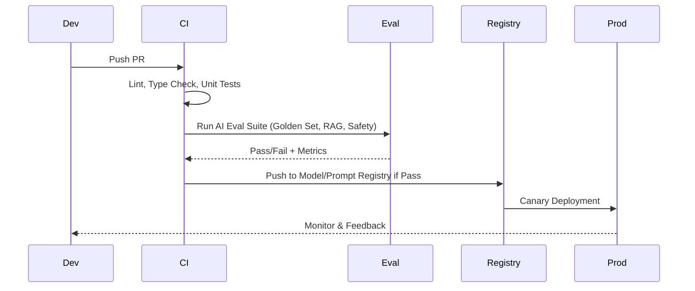

# AI/LLM Implementer Onboarding Guide

This document is designed to accelerate ramp-up for engineers implementing, integrating, and maintaining Large Language Model (LLM) features in our codebase. It covers architecture, workflows, standards, and AI-specific operational practices.

---

## 1. Project Overview & Business Context

| Aspect | Details |
|--------|---------|
| **Domain** | [e.g., SaaS Analytics, Healthcare, FinTech, etc.] |
| **Target Users** | [e.g., Enterprise admins, end-users, internal analysts] |
| **Core AI Features** | [e.g., RAG-based Q&A, code generation, document summarization, chat assistant] |
| **Success Metrics** | Latency < 2s, hallucination rate < 3%, cost <$0.01/query, user satisfaction > 4.2/5 |
| **AI Dependencies** | External APIs (OpenAI, Anthropic, etc.), local GPU inference, vector databases, external RAG sources |

> 💡 **Why AI here?** The LLM layer replaces/augments rule-based workflows, handles unstructured data, and enables natural language interactions. All AI outputs must be auditable, fallback-safe, and cost-aware.

---

## 2. System Architecture & Module Breakdown

### High-Level Architecture


### Module Responsibilities
| Module | Purpose | AI-Specific Notes |
|--------|---------|-------------------|
| **API Gateway** | Route requests, auth, rate limiting | Enforce token limits, route `/ai/*` to orchestrator |
| **LLM Orchestrator** | Central AI routing, prompt assembly, fallback chains | Handles streaming, caching, retry logic, cost tracking |
| **Prompt Manager** | Versioned prompt templates, Jinja/YAML configs | Supports prompt branching, A/B testing, seed control |
| **Vector Store / RAG** | Semantic search, chunk retrieval, hybrid filtering | Configurable chunk size, overlap, embedding model, reranking |
| **Model Registry** | Store model/prompt versions, metadata, eval scores | Tracks drift, supports canary rollouts, model cards |
| **Inference Backend** | GPU/CPU serving, batching, async processing | Supports vLLM, TGI, or cloud API wrappers |
| **Observability** | Tracing, latency, cost, hallucination detection | LangSmith, Arize, Prometheus, custom dashboards |

---

## 3. Environment & Toolchain Setup

### Local Development
```bash
# 1. Clone & setup
git clone <repo> && cd <repo>
python -m venv .venv && source .venv/bin/activate
pip install -r requirements.txt

# 2. Environment variables
cp .env.example .env
# Required: OPENAI_API_KEY, VECTOR_DB_URI, EMBEDDING_MODEL, LOG_LEVEL

# 3. Start services (Docker Compose)
docker compose up -d postgres qdrant minio

# 4. Run AI eval suite locally
pytest tests/ai/ --cov=src/ai
```

### Key Toolchain
| Category | Tools |
|----------|-------|
| **Orchestration** | LangChain, LlamaIndex, custom router |
| **Model Tracking** | MLflow, Weights & Biases, HuggingFace Hub |
| **Data Versioning** | DVC, LakeFS, Parquet/JSONL formats |
| **Observability** | LangSmith, Arize Phoenix, Prometheus, Grafana |
| **CI/CD** | GitHub Actions, ArgoCD, Terraform |

---

## 4. Data & Prompt Engineering Standards

### Prompt Versioning & Structure
- Prompts live in `src/ai/prompts/` as versioned YAML/Jinja files.
- Naming: `v{major}.{minor}.{patch}-{usecase}.yaml`
- Must include: `system`, `user`, `few_shot_examples`, `output_schema`, `temperature`, `max_tokens`, `seed`
- Never hardcode prompts in business logic.

```yaml
# prompts/v1.2.0-document-summary.yaml
system: "You are a technical summarizer. Output only JSON matching the schema."
user: "Summarize the following document:\n{document_text}"
output_schema:
  type: object
  properties:
    key_points: { type: array, items: { type: string } }
    sentiment: { type: string, enum: [positive, neutral, negative] }
  required: [key_points, sentiment]
params:
  temperature: 0.2
  max_tokens: 512
  seed: 42
```

### RAG Pipeline Configuration
| Component | Standard |
|-----------|----------|
| **Chunking** | RecursiveCharacterTextSplitter, 512-1024 tokens, 10-20% overlap |
| **Embeddings** | `text-embedding-3-large` or local `bge-m3` |
| **Vector DB** | Qdrant/Weaviate, cosine similarity, metadata filters for source/tenant |
| **Reranking** | Cross-encoder (e.g., `bge-reranker-v2-m3`) on top-10 results |
| **Caching** | Redis-based prompt+input hash cache, TTL 24h, bypass for fresh data |

---

## 5. Model Lifecycle & Evaluation Framework

### Model Lifecycle Flow


### Evaluation Strategy
| Eval Type | Tools/Metrics | Frequency |
|-----------|---------------|-----------|
| **Accuracy/Correctness** | RAGAS, DeepEval, golden dataset match | Every PR + weekly |
| **Latency & Throughput** | p50/p95 latency, tokens/sec, queue depth | Continuous |
| **Safety & Compliance** | Prompt injection tests, PII leakage, toxicity filters | On every prompt/model change |
| **Cost Efficiency** | $/query, token utilization, cache hit rate | Daily dashboard |
| **User Feedback** | Thumb up/down, correction rate, session drop-off | Weekly |

> 📌 **Golden Dataset**: Stored in `data/eval/golden/`. Must be versioned with DVC. Includes edge cases, adversarial prompts, and multilingual samples.

---

## 6. Coding Standards & Documentation Requirements

### AI-Specific Coding Standards
- **Docstrings**: Must include `prompt_version`, `fallback_model`, `expected_latency`, `eval_score`
- **Seed Control**: Set `seed` for reproducibility in tests; document non-deterministic behavior in production
- **Fallback Chains**: Always define graceful degradation (e.g., `GPT-4o → GPT-3.5-turbo → cached response`)
- **Error Handling**: Wrap LLM calls in `LLMCallError`, `RateLimitError`, `ContentFilterError` with structured logging
- **Type Hinting**: Use `typing.TypedDict` for output schemas; validate with `pydantic`

```python
async def generate_summary(
    doc: str,
    prompt_version: str = "v1.2.0-document-summary.yaml",
    fallback: list[str] = ["gpt-4o-mini", "cached"]
) -> SummaryOutput:
    """Generate structured summary with fallback chain.
    
    Args:
        doc: Raw document text
        prompt_version: Versioned prompt key
        fallback: Model fallback sequence
    
    Returns:
        Validated SummaryOutput pydantic model
    
    Raises:
        LLMCallError: On API failure or content filter block
    """
```

### Documentation Requirements
| Artifact | Location | Owner | Update Trigger |
|----------|----------|-------|----------------|
| **Model Card** | `docs/models/{model}.md` | AI Engineer | New version, eval change |
| **Data Sheet** | `docs/data/{dataset}.md` | Data Engineer | Schema/version change |
| **ADR** | `docs/adr/` | Architect | Major AI decision |
| **Runbook** | `docs/runbooks/ai-incident.md` | SRE/ML Eng | Deployment, outage |
| **API Docs** | `docs/api/ai.yaml` | Backend Eng | Endpoint change |

---

## 7. Testing, QA & AI-Specific Validation

### CI/CD & AI Testing Pipeline


### AI Testing Checklist
- [ ] **Deterministic Tests**: Mock LLM with fixed responses, test prompt assembly, cache logic
- [ ] **Non-Deterministic Tests**: Run with `seed`, verify output schema validation, check hallucination thresholds
- [ ] **RAG Pipeline Tests**: Chunk boundaries, embedding drift, vector search recall@k, reranker impact
- [ ] **Load Tests**: 100 concurrent queries, queue overflow handling, rate limit backoff
- [ ] **Safety Tests**: Prompt injection patterns, PII masking, output filtering rules
- [ ] **Cost Tests**: Token accounting, cache bypass scenarios, fallback cost comparison

---

## 8. Security, Compliance & Governance

| Concern | Implementation |
|---------|----------------|
| **PII Handling** | Regex + NER masking before prompt injection; log redacted versions only |
| **Prompt Injection** | Input sanitization, system prompt isolation, output schema enforcement |
| **Content Filtering** | Dual-layer: model-native filters + post-processing classifiers |
| **Access Control** | RBAC for prompt/model registry; tenant-isolated vector namespaces |
| **Audit Logging** | Immutable logs: prompt, response, latency, cost, user_id, model_version |
| **Compliance** | GDPR/CCPA data deletion hooks, SOC2 audit trails, model use policy approvals |

> 🔒 **Rule**: No raw PII leaves the app boundary. All AI calls must include `tenant_id` and `user_id` for traceability.

---

## 9. Deployment, Infrastructure & Cost Management

### Infrastructure Patterns
- **Inference**: vLLM/TGI for local GPU, cloud API for burst scaling
- **Scaling**: Horizontal pod autoscaling based on queue depth & latency p95
- **Deployment**: Canary (10% → 50% → 100%) with automated rollback on eval degradation
- **Cost Tracking**: Tag all LLM calls with `project`, `feature`, `model`. Daily cost reports per team.

### Monitoring & Alerting
| Metric | Threshold | Alert Channel |
|--------|-----------|---------------|
| p95 Latency | > 2.5s | PagerDuty |
| Hallucination Rate | > 5% | Slack #ai-alerts |
| Cost/Day | > $500 | Finance dashboard |
| Cache Hit Rate | < 60% | Slack #ai-alerts |
| Error Rate | > 2% | PagerDuty |

---

## 10. Workflows, Collaboration & Troubleshooting

### Git & PR Workflow
1. Branch: `feat/ai-{feature}` or `fix/ai-{bug}`
2. PR must include: eval results, prompt/model version, cost impact, runbook updates
3. Review checklist: schema validation, fallback chain, seed control, cost tagging, safety tests
4. Merge: automated registry push, canary deployment, metrics baseline capture

### AI Troubleshooting Runbook
| Symptom | Diagnostic Step | Resolution |
|---------|-----------------|------------|
| High latency | Check queue depth, embedding cache, model queue | Scale pods, enable batching, switch to faster model |
| Hallucinations | Inspect RAG recall, prompt clarity, temperature | Increase chunk quality, add few-shot, lower temp |
| Cost spikes | Audit token counts, cache bypass, fallback chains | Enable caching, restrict fallback, prune prompts |
| Inconsistent outputs | Check seed, version drift, non-deterministic params | Lock seed, pin version, add validation layer |
| Prompt injection | Review input sanitization, system prompt isolation | Add regex filters, schema enforcement, output scrubbing |

### Communication & Escalation
- **Daily**: #ai-dev Slack channel, metrics dashboard review
- **Weekly**: AI sync meeting (engineering, data, product, compliance)
- **Escalation**: SRE → ML Lead → Architecture Review Board (for cost/safety breaches)

---

## Appendix

### Quick Start Checklist
- [ ] Clone repo, setup `.env`, run `docker compose up`
- [ ] Run `pytest tests/ai/` and verify eval suite passes
- [ ] Review `docs/models/` and `docs/adr/` for recent AI decisions
- [ ] Deploy local canary to `localhost:8080/ai/test`
- [ ] Run cost & latency profiler: `python scripts/ai_profiler.py`
- [ ] Join #ai-dev Slack, subscribe to metrics dashboard

### Glossary
| Term | Definition |
|------|------------|
| **RAG** | Retrieval-Augmented Generation: fetches relevant context before LLM call |
| **Golden Dataset** | Curated, versioned test set with expected outputs for eval |
| **Prompt Versioning** | Semantic versioning of prompt templates with metadata & params |
| **Fallback Chain** | Ordered list of models/caches used when primary fails or degrades |
| **Model Card** | Document describing model capabilities, training data, eval results, limitations |
| **Drift Detection** | Monitoring statistical shifts in input/output distributions over time |

### References
- Internal: `docs/ai-architecture.pdf`, `docs/eval-framework.md`, `docs/cost-tracking.md`
- External: LangSmith docs, RAGAS docs, vLLM docs, OWASP LLM Top 10

---
🔁 **Last Updated**: `[Date]` | 📝 **Maintainer**: `AI Platform Team` | 🐛 **Report Issues**: `#ai-onboarding` channel or GitHub issue template `AI_RampUp`