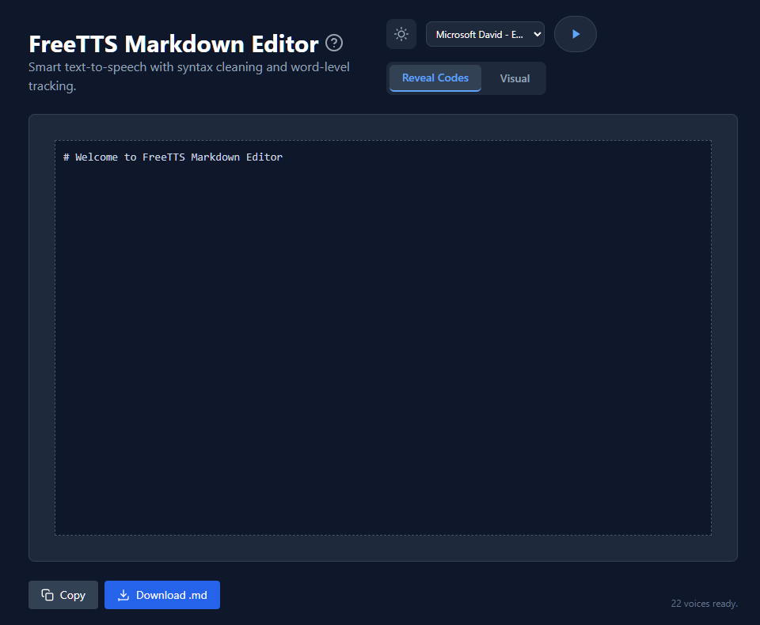

# **FreeTTS**

***Free Markdown Editor with integrated Web-based TTS. Lightweight. No downloads for Web Speech.***

*A TypeScript-powered single-page application designed for portability, reactivity, and ease of integration.*

## **Key Features**

### **1\. Hybrid Editing Modes**

* **Reveal Codes (Source Mode):** A high-performance text editor for direct Markdown manipulation with monospace font support and syntax visibility.  
* **Visual Mode:** A WYSIWYG experience powered by the Milkdown framework, providing instant rendering of tables, blockquotes, and formatting.

### **2\. Smart Text-to-Speech (TTS)**

Unlike standard screen readers, our TTS engine is optimized for Markdown:

* **Syntax Cleaning:** Automatically strips structural symbols (like `###`, `**`, `| --- |`) during playback to ensure natural-sounding speech.  
* **Word-Level Tracking:** Synchronizes the voice engine with the editor. As words are spoken, the corresponding text in the source code is automatically highlighted.  
* **Selection Support:** Highlight a specific paragraph to listen to it, or place the cursor to play from that point forward.

### **3\. Reactive State Management**

* **AppStore:** Centralized reactive state powered by [ReactiveTypescript](https://github.com/ReactiveTypescript/ReactiveTypescript), ensuring all modules stay synchronized without manual prop drilling.  
* **Settings Persistence:** Engine, voice, speed, pitch, and theme settings are automatically saved to `localStorage` and restored on reload.

### **4\. Modern UI/UX**

* **Theme Switcher:** Seamless transition between Light and Dark modes, persisted via local storage (respects `prefers-color-scheme`).  
* **Responsive Design:** Built with Tailwind CSS to ensure a premium experience across mobile, tablet, and desktop.  
* **Integrated Guide:** A comprehensive built-in cheatsheet for Markdown syntax and TTS shortcuts.

## **Technical Stack**

* **Language:** TypeScript (ES2020 target, strict mode)  
* **Build Tool:** Vite 8 (HMR, optimized bundling)  
* **Core Editor:** [Milkdown](https://milkdown.dev/) 7.20 (Plugin-based WYSIWYG framework)  
* **State Management:** [ReactiveTypescript](https://github.com/ReactiveTypescript/ReactiveTypescript) (reactive singleton store)  
* **Styling:** [Tailwind CSS](https://tailwindcss.com/) for fluid layouts and dark mode  
* **Icons:** [Lucide](https://lucide.dev/) (via inline SVG)  
* **TTS Engines:** Native Web Speech API + Kokoro TTS (`kokoro-js` + ONNX Runtime Web)  
* **Testing:** Vitest 4 with happy-dom (unit + integration tests)

## **Requirements**

### **Web Speech API (No Downloads)**
The Web Speech engine requires **no downloads or setup** — it uses the browser's built-in `SpeechSynthesis` API. Voice availability depends on the user's browser and operating system.

### **Kokoro TTS (Neural Engine)**
The Kokoro TTS engine requires downloading a neural TTS model from Hugging Face on first use. The model is cached in the browser's IndexedDB and only downloads once.

| Backend | Model File | Size |
|---------|-----------|------|
| WebGPU | `model.onnx` | 326 MB |
| WASM | `model_q8f16.onnx` | 86 MB |

**Important:** The first time Kokoro TTS is used, the model download may take several minutes depending on your internet connection. A stable internet connection is required for the initial download. Subsequent uses are instant from cache.

**Browser compatibility:** WebGPU is only available in Chromium-based browsers (Chrome, Edge). Firefox and Safari fall back to the smaller WASM model (86 MB).

## **How to Use**

1. **Compose:** Type your Markdown in "Reveal Codes" mode for precision or "Visual" mode for comfort.  
2. **Listen:** Select a block of text and click the Play icon in the header. Use the dropdown to switch between available system voices.  
3. **Export:** Use the **Copy** button to grab the raw Markdown to your clipboard or **Download .md** to save the file locally.  
4. **Customize:** Toggle the moon/sun icon to match your preferred environment.

## **Markdown Support**

The editor supports GitHub Flavored Markdown (GFM), including:

* Tables with alignment  
* Task lists \[x\]  
* Strike-through \~\~text\~\~  
* Code blocks with syntax highlighting placeholders  
* Blockquotes and nested lists

## **Screenshot**


## **Development**

```bash
# Install dependencies
npm install

# Start development server (Vite with HMR)
npm run dev

# Build for production
npm run build

# Run tests
npm test

# Run tests with coverage
npm run test:coverage
```

For detailed architecture, build, deployment, and CI/CD instructions, see:
- [CLAUDE.md](./app-docs/CLAUDE.md) — Architecture and module guide
- [DEVOPS.md](./app-docs/DEVOPS.md) — Build, test, deploy, and troubleshooting
- [APP-SUMMARY.md](./app-docs/APP-SUMMARY.md) — High-level overview and dependency map


## **Acknowledgements**

Kokoro TTS: https://github.com/hexgrad/kokoro

