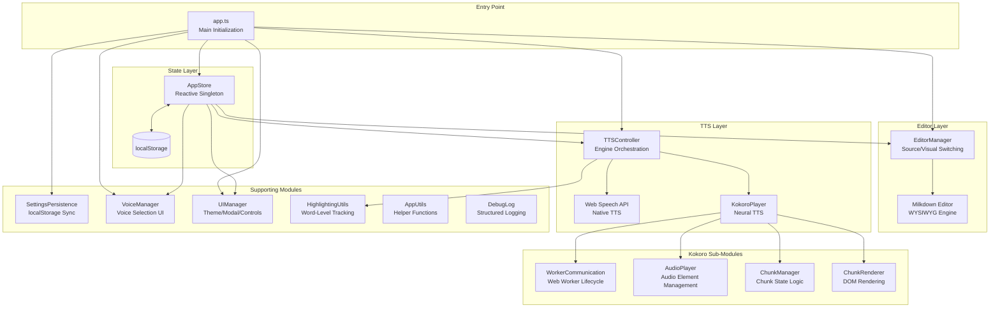
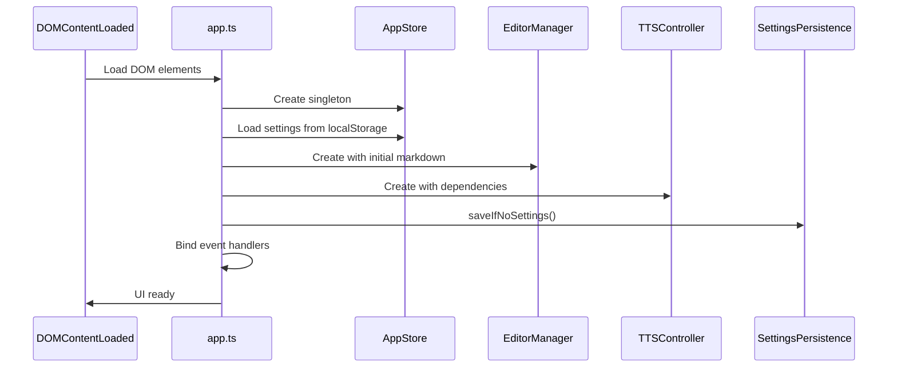
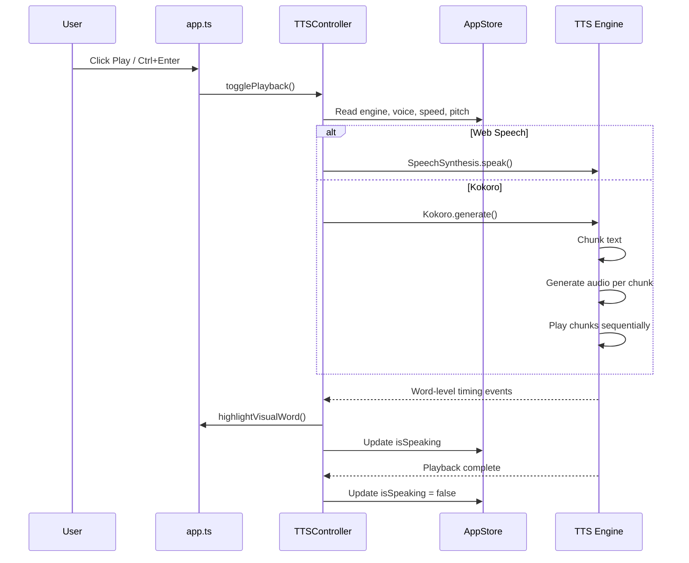
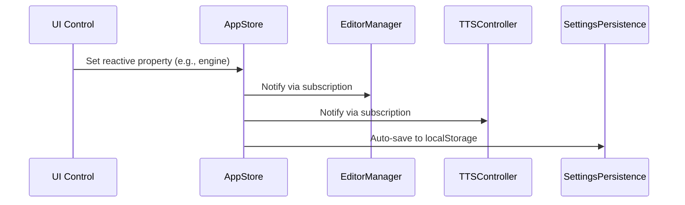

# Architecture Overview

FreeTTS is built on a modular, reactive architecture. This document describes the system design, module responsibilities, and data flow.

## High-Level Architecture



## Module Responsibilities

### `app.ts` — Application Entry Point

The main initialization module orchestrates all other modules:

1. **DOM Setup:** References all UI elements (editor, controls, modals).
2. **Browser Detection:** Identifies Safari and mobile devices for feature gating.
3. **Module Initialization:** Creates instances of `AppStore`, `EditorManager`, `TTSController`, `KokoroPlayer`, and supporting modules.
4. **Event Binding:** Connects UI controls to module methods.
5. **State Synchronization:** Ensures all modules stay in sync via `AppStore` reactive properties.
6. **Keyboard Shortcuts:** Handles `Ctrl+Enter` / `Cmd+Enter` for TTS toggle.

### `app-store.ts` — Centralized Reactive State

The `AppStore` singleton is the heart of FreeTTS's reactive architecture:

- **Pattern:** Uses [ReactiveTypescript](https://github.com/ReactiveTypescript/ReactiveTypescript) decorators (`@reactiveValue`, `@reactiveList`, `@reactiveDict`).
- **Reactive Properties:** All state (engine, voice, speed, pitch, theme, playback, editor) is wrapped in reactive values that notify subscribers on change.
- **Serialization:** Full state can be serialized to JSON and restored from `localStorage` with silent hydration (no change events during restore).
- **Enums:** `EngineEnum`, `StatusEnum`, `ThemeEnum` define typed constants.

**Key reactive properties:**

| Property | Type | Description |
|----------|------|-------------|
| `engine` | `ReactiveValue<EngineEnum>` | Current TTS engine |
| `voice` | `ReactiveValue<string>` | Selected voice name |
| `speed` | `ReactiveValue<number>` | Playback speed (0.5–2.0) |
| `pitch` | `ReactiveValue<number>` | Voice pitch (0.5–2.0) |
| `theme` | `ReactiveValue<ThemeEnum>` | UI theme (light/dark) |
| `isPlaying` | `ReactiveValue<boolean>` | Playback active state |
| `isSpeaking` | `ReactiveValue<boolean>` | TTS speaking state |
| `currentMarkdown` | `ReactiveValue<string>` | Current editor content |
| `isSourceMode` | `ReactiveValue<boolean>` | Editor mode flag |
| `voices` | `ReactiveList<VoiceInfo>` | Available Web Speech voices |
| `kokoroVoices` | `ReactiveList<KokoroVoiceInfo>` | Available Kokoro voices |
| `status` | `ReactiveValue<StatusEnum>` | Kokoro status |
| `activeDevice` | `ReactiveValue<string>` | Active audio device |

### `editor-manager.ts` — Dual-Mode Editor

Manages switching between Source (textarea) and Visual (Milkdown WYSIWYG) modes:

- **Source Mode:** Raw Markdown in a `<textarea>` with monospace font.
- **Visual Mode:** Milkdown editor with Nord theme, CommonMark, GFM, history, and listener plugins.
- **Sync:** Markdown changes in Visual mode are synced back to the source textarea and `AppStore`.
- **Lazy Initialization:** Milkdown editor is created on first switch to Visual mode.

### `tts-controller.ts` — TTS Engine Orchestration

Coordinates playback across both TTS engines:

- **Engine Selection:** Routes playback to Web Speech API or Kokoro based on `AppStore.engine`.
- **Syntax Cleaning:** Strips Markdown symbols before TTS input via `cleanMarkdown()`.
- **Word-Level Highlighting:** Synchronizes spoken word offsets with editor display via `highlightVisualWord()`.
- **Selection Handling:** Respects text selection — plays only selected content or the full document.
- **State Management:** Subscribes to `AppStore.isPlaying` for reactive state updates.

### `kokoro-player.ts` — Neural TTS Playback

Orchestrates chunk-based Kokoro audio playback:

- **Chunking:** Splits text into manageable chunks for streaming audio generation.
- **Worker Communication:** Manages Web Worker lifecycle for ONNX Runtime inference.
- **Audio Playback:** Creates and manages `<audio>` elements for each chunk.
- **Mobile Support:** Handles mobile autoplay policies with muted start + tap-to-play indicators.
- **Download:** Merges all chunk WAVs into a single downloadable file.

### `settings-persistence.ts` — Settings Sync

Thin wrapper around `AppStore` for backward compatibility:

- **Auto-save:** Settings are saved on every change.
- **Auto-restore:** Settings are loaded on initialization.
- **Per-engine voices:** Separate voice saved for Web Speech and Kokoro.
- **Reset:** Clears all saved settings from `localStorage`.

### `voice-manager.ts` — Voice Selection

Handles voice UI population and restoration:

- **Web Speech Voices:** Loaded via `speechSynthesis.getVoices()`.
- **Kokoro Voices:** Loaded from the `kokoro-js` voice registry.
- **Saved Voice Restoration:** Resolves saved voice by name or index, falls back to first available.

### `ui-manager.ts` — UI State Management

Handles theme toggling, modals, and playback controls:

- **Theme Toggle:** Switches light/dark mode, persists to `AppStore`.
- **Help Modal:** Shows/hides the Markdown cheatsheet.
- **Playback Controls:** Updates play/stop icons based on speaking state.
- **Clipboard/Download:** Copy Markdown to clipboard or download as `.md`.

### `highlighting-utils.ts` — Word-Level Tracking

Utilities for synchronizing spoken words with editor display:

- **`highlightVisualWord()`:** Uses `TreeWalker` to find and highlight the character range in Visual mode.
- **`getVisualCursorInfo()`:** Gets selected text and offset from Visual mode selection.
- **`cleanMarkdown()`:** Strips Markdown syntax for natural TTS playback.

### `app-utils.ts` — Helper Functions

General utility functions:

- **`updateStatusMsg()`:** Updates status display with device indicator.
- **`toggleHidden()`:** Toggles CSS `hidden` class.
- **`capitalizeMsg()`:** Capitalizes first character of a string.
- **`getSelectedEngine()`:** Reads current engine selection from dropdown.

### `debug-log.ts` — Structured Logging

Conditional debug logging with visual markers and performance timers:

- **`debugLog()`:** Logs with `>>>` markers (only when debug mode is enabled).
- **`debugWarn()`:** Logs warnings with `!!!` markers.
- **`debugError()`:** Logs errors with `###` markers.
- **`debugLogArray()`:** Logs arrays with formatted headers/footers and optional timers.
- **`repeatChar()`:** Creates repeated character strings for formatting.

### `global-switches.ts` — Global Configuration

Global configuration flags:

- **`debugMode`:** Controls whether debug logging is active.
- **`setDebugMode()` / `getDebugMode()`:** Accessors for debug mode.

## Data Flow

### Initialization Flow



### Playback Flow



### State Change Flow



## File Structure

```
src/
├── app.ts                      # Main entry point
├── app-store.ts                # Centralized reactive state
├── app-utils.ts                # Helper utilities
├── debug-log.ts                # Structured debug logging
├── editor-manager.ts           # Source/Visual editor switching
├── global-switches.ts          # Global configuration flags
├── highlighting-utils.ts       # Word-level highlighting
├── kokoro-audio-player.ts      # Audio element management
├── kokoro-chunk-manager.ts     # Chunk state logic
├── kokoro-chunk-renderer.ts    # Chunk card DOM rendering
├── kokoro-player.ts            # Kokoro playback orchestrator
├── kokoro-worker-communication.ts  # Web Worker lifecycle
├── settings-persistence.ts     # localStorage sync
├── tts-controller.ts           # TTS engine orchestration
├── tts-worker.js               # Kokoro Web Worker script
├── ui-manager.ts               # Theme, modal, controls
└── voice-manager.ts            # Voice selection UI
```

## Dependencies

### Runtime Dependencies

| Package | Version | Purpose |
|---------|---------|---------|
| `@milkdown/core` | 7.20 | WYSIWYG editor core |
| `@milkdown/plugin-history` | 7.20 | Undo/redo support |
| `@milkdown/plugin-listener` | 7.20 | Markdown update events |
| `@milkdown/preset-commonmark` | 7.20 | CommonMark syntax |
| `@milkdown/preset-gfm` | 7.20 | GitHub Flavored Markdown |
| `@milkdown/theme-nord` | 7.20 | Nord visual theme |
| `@milkdown/utils` | 7.20 | Editor utilities |
| `kokoro-js` | 1.2.0 | Neural TTS engine |
| `onnxruntime-web` | 1.22.0 | ONNX Runtime for browser |
| `phonemizer` | 1.2.1 | Text phonemization |

### Development Dependencies

| Package | Version | Purpose |
|---------|---------|---------|
| `vite` | 8.0.9 | Build tool and dev server |
| `vitest` | 4.1.5 | Testing framework |
| `@vitest/browser` | 4.1.5 | Browser test runner |
| `happy-dom` | 20.9.0 | DOM implementation for tests |
