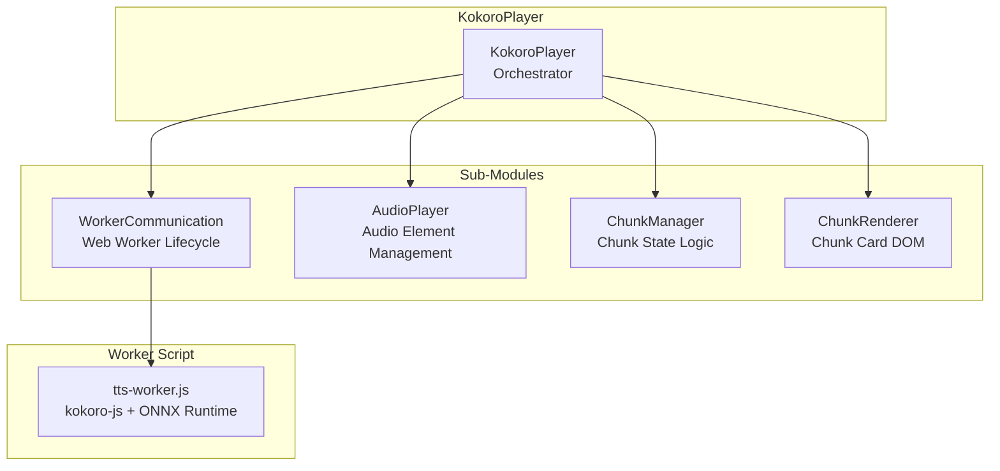
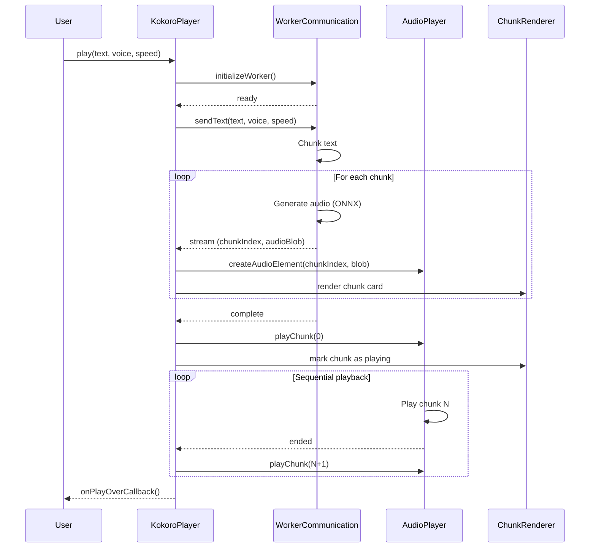

# Kokoro Player

The `KokoroPlayer` class orchestrates chunk-based audio playback for the Kokoro neural TTS engine. It manages the Web Worker lifecycle, audio element playback, chunk state, and DOM rendering.

## Architecture



## Constructor

```typescript
class KokoroPlayer {
    constructor(
        containerId: string,           // DOM container ID for chunk cards
        statusCallback: (msg: string) => void,  // Status message callback
        activeDeviceCallback: (device: string) => void,  // Active device callback
        uiStateCallback?: (active: boolean) => void,  // UI speaking state
        scrollCallback?: (offset: number, length: number) => void,  // Scroll sync
        onPlayOverCallback?: () => void,  // Playback complete callback
    ) {}
}
```

## Sub-Modules

### WorkerCommunication

Manages the Web Worker lifecycle:

- **WebGPU Detection:** Checks `navigator.gpu` availability.
- **Worker Creation:** Creates a Web Worker from `tts-worker.js`.
- **Message Routing:** Routes messages between main thread and worker.
- **Cleanup:** Terminates worker on stop.

**Message Protocol:**

| Direction | Message | Description |
|-----------|---------|-------------|
| To Worker | `{ status: 'init', useWebGPU: boolean }` | Initialize worker with backend |
| To Worker | `{ text: string, voice: string, speed: number }` | Generate speech |
| From Worker | `{ status: 'device', device: string }` | Backend detected |
| From Worker | `{ status: 'ready' }` | Worker ready |
| From Worker | `{ status: 'stream', chunkIndex: number, audioBlob: Blob }` | Audio chunk ready |
| From Worker | `{ status: 'complete' }` | All chunks generated |
| From Worker | `{ status: 'error', message: string }` | Error occurred |

### AudioPlayer

Manages `<audio>` element lifecycle:

- **Registration:** Associates audio elements with chunk indices.
- **Creation:** Creates audio elements from WAV Blobs using `URL.createObjectURL()`.
- **Playback:** Plays chunks sequentially.
- **Cleanup:** Revokes object URLs and removes elements.

### ChunkManager

Delegates chunk state operations:

- **Start Playback:** Begins playing a specific chunk.
- **Chunk Click:** Handles seeking to a specific chunk.
- **Chunk Ended:** Advances to the next chunk.
- **Mobile Detection:** Checks if running on mobile.

### ChunkRenderer

Renders chunk cards in the DOM:

- **Card Creation:** Creates DOM elements for each chunk with text label and audio controls.
- **Event Binding:** Binds play/pause/ended events to player callbacks.
- **Seek-by-Click:** Allows clicking a chunk card to jump to that position.
- **State Updates:** Updates card appearance based on playback state.

## Playback Flow



## Key Methods

### play()

Starts playback for the given text:

```typescript
async play(
    text: string,
    voice: string,
    speed: number,
    startOffset: number = 0
): Promise<void>
```

1. Initializes the Web Worker (if not already initialized).
2. Sends text to the worker for audio generation.
3. Creates audio elements for each chunk.
4. Renders chunk cards in the DOM.
5. Begins sequential playback.

### stop()

Stops all playback and cleans up:

```typescript
stop(): void
```

1. Pauses all audio elements.
2. Terminates the Web Worker.
3. Removes chunk cards from the DOM.
4. Resets all state.

### downloadMerged()

Merges all chunk WAVs into a single downloadable file:

```typescript
downloadMerged(): void
```

1. Concatenates all chunk audio Blobs.
2. Creates a merged WAV Blob.
3. Triggers a browser download.

### State Properties

| Property | Type | Description |
|----------|------|-------------|
| `chunks` | `any[]` | Generated audio chunks |
| `currentChunkIndex` | `number` | Currently playing chunk index |
| `status` | `string` | Player status (`'ready'`, `'generating'`, `'error'`) |
| `isSpeaking` | `boolean` | Whether currently speaking |
| `isStopped` | `boolean` | Explicitly stopped flag |
| `mergedBlob` | `Blob \| null` | Merged WAV Blob for download |

## Mobile Considerations

Kokoro TTS is **disabled on mobile devices** due to ONNX Runtime constraints:

```typescript
// Mobile detection in ChunkManager
isMobileBrowser(): boolean {
    return this.player.isMobile;
}
```

Mobile browsers also enforce autoplay policies, so Kokoro starts muted and shows "Tap to play" indicators.

## Error Handling

The KokoroPlayer handles errors at multiple levels:

1. **Worker Initialization:** Catches WebGPU detection failures and falls back to WASM.
2. **Audio Generation:** Catches generation errors and reports via status callback.
3. **Playback:** Catches audio playback failures and advances to the next chunk.
4. **Model Download:** Handles Hugging Face download failures with user-friendly messages.

## Integration with TTSController

The `KokoroPlayer` is used by `TTSController` for neural TTS playback:

```typescript
// In TTSController
const kokoroPlayer = new KokoroPlayer(
    'chunk-container',
    (msg) => updateStatusMsg(msg),
    (device) => updateActiveDevice(device),
    (active) => setUIState(active),
    (offset, length) => highlightVisualWord(offset, length, visualEl),
    () => resetStatusAfterDelay(),
);

// Playback
await kokoroPlayer.play(text, voice, speed, startOffset);

## Related Documentation

- **[DevOps Guide](DEVOPS.md)** — Building, testing, and deployment.
- **[TypeScript API: KokoroPlayer](api/kokoro-player.md)** — Detailed KokoroPlayer API.
- **[TTS Engines](tts_engines.md)** — Overview of both TTS engines.
- **[Architecture Overview](app_logic.md)** — System architecture and module design.
- **[Testing: Kokoro](testing/unit-tests.md)** — Kokoro unit tests.```
