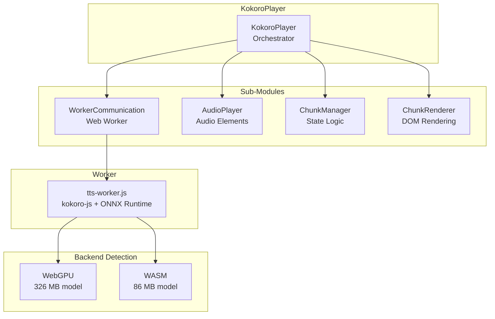
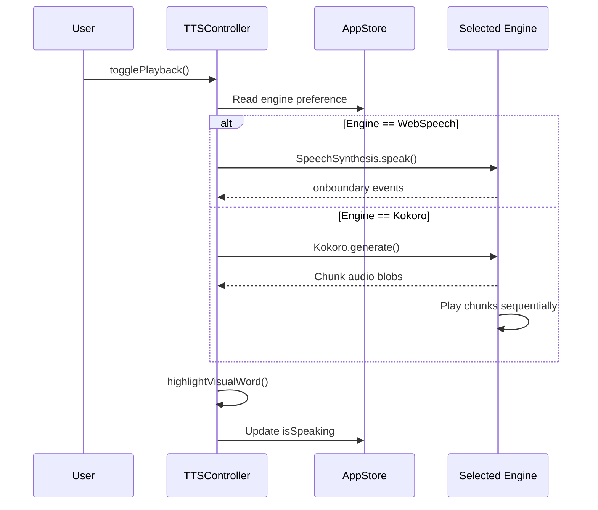

# TTS Engines

FreeTTS supports two text-to-speech engines: the native Web Speech API and the neural Kokoro TTS engine. This document describes each engine, their capabilities, and how they're orchestrated.

## Engine Comparison

| Feature | Web Speech API | Kokoro TTS |
|---------|---------------|------------|
| **Type** | Browser-native | Neural (ONNX Runtime) |
| **Setup** | None required | Model download required |
| **Model Size** | N/A | 326 MB (WebGPU) / 86 MB (WASM) |
| **Voice Quality** | Good | Excellent (neural) |
| **Voice Selection** | OS-dependent, many voices | Limited, high quality |
| **Mobile Support** | ✅ Full | ❌ Disabled |
| **Browser Support** | All browsers | Chromium (WebGPU) / All (WASM) |
| **Offline** | ✅ Yes | ❌ Requires initial download |
| **Word Highlighting** | ✅ Yes | ✅ Yes |

## Web Speech API

The Web Speech API uses the browser's built-in `SpeechSynthesis` API. No downloads or setup required.

### How It Works

```typescript
// Get available voices
const voices = speechSynthesis.getVoices();

// Create utterance
const utterance = new SpeechSynthesisUtterance(text);
utterance.voice = selectedVoice;
utterance.rate = speed;
utterance.pitch = pitch;

// Speak
speechSynthesis.speak(utterance);
```

### Voice Selection

Voices are provided by the operating system and vary by platform:

- **Windows:** Microsoft voices (Zira, David, Hazel, etc.)
- **macOS:** Apple voices (Samantha, Alex, etc.)
- **Linux:** Depends on installed speech packages
- **Mobile:** Platform-specific voices

Voice availability is loaded via `loadWebSpeechVoices()` in `voice-manager.ts`.

### Word-Level Highlighting

The Web Speech API provides `onboundary` events that report the character offset of each spoken word. FreeTTS uses this to highlight the corresponding text in the editor.

```typescript
utterance.onboundary = (event) => {
    if (event.name === 'word') {
        highlightVisualWord(event.charIndex, wordLength, visualElement);
    }
};
```

### Limitations

- Voice quality varies by OS/browser.
- Limited control over prosody and emotion.
- No phoneme-level control.

## Kokoro TTS

Kokoro is a neural text-to-speech engine that runs in the browser using ONNX Runtime. It produces high-quality, natural-sounding speech.

### Architecture



### Model Download

On first use, Kokoro downloads the neural model from Hugging Face:

| Backend | Model | Size | Browser Support |
|---------|-------|------|-----------------|
| WebGPU | `model.onnx` | 326 MB | Chrome 113+, Edge 113+ |
| WASM | `model_q8f16.onnx` | 86 MB | All browsers |

The model is cached in IndexedDB and only downloads once.

### Chunk-Based Playback

Kokoro generates audio in chunks for smooth streaming:

1. **Text Chunking:** Input text is split into manageable segments.
2. **Parallel Generation:** Each chunk is sent to the Web Worker for audio generation.
3. **Sequential Playback:** Generated audio chunks are played in sequence.
4. **DOM Rendering:** Each chunk is displayed as a card with play controls.

```typescript
// Chunk generation flow
const chunks = chunkText(text);  // Split text into chunks
for (const chunk of chunks) {
    const audioBlob = await worker.generate(chunk, voice, speed);
    audioPlayer.createAudioElement(index, audioBlob);
}
audioPlayer.playChunk(0);  // Start sequential playback
```

### Web Worker Communication

The `WorkerCommunication` class manages the Web Worker lifecycle:

```typescript
// Message protocol
// To worker:
{ status: 'init', useWebGPU: boolean }
{ text: string, voice: string, speed: number }

// From worker:
{ status: 'device', device: 'webgpu' | 'wasm' }
{ status: 'ready' }
{ status: 'stream', chunkIndex: number, audioBlob: Blob }
{ status: 'complete' }
{ status: 'error', message: string }
```

### Mobile Support

Kokoro TTS is **disabled on mobile devices** due to ONNX Runtime constraints. The `ChunkManager.isMobileBrowser()` method detects mobile and prevents Kokoro initialization.

Mobile browsers also enforce autoplay policies, so Kokoro starts muted and shows "Tap to play" indicators.

### Download Merged Audio

All generated chunks can be merged into a single WAV file for download:

```typescript
player.downloadMerged();  // Creates merged Blob and triggers download
```

### Voice Selection

Kokoro voices are loaded from the `kokoro-js` library:

```typescript
interface KokoroVoiceInfo {
    name: string;      // Voice identifier (e.g., 'af_heart')
    language: string;  // Language code (e.g., 'en')
    gender: string;    // Gender (e.g., 'female')
}
```

Available voices include:
- `af_heart` — Female, warm
- `af_bella` — Female, energetic
- `am_adam` — Male, deep
- `am_michael` — Male, casual
- And many more

## TTSController

The `TTSController` class orchestrates playback across both engines:

```typescript
class TTSController {
    constructor(
        elements,           // DOM elements
        editorManager,      // Editor mode manager
        kokoroPlayer,       // Kokoro player instance
        highlightVisualWord, // Highlighting callback
        getVisualCursorInfo, // Cursor info callback
        voices,             // Available voices
        isSafari,           // Safari detection
        isSpeakingCallback, // Speaking state callback
    ) {}

    togglePlayback(
        stopWebSpeech,      // Web Speech stop callback
        stopKokoro,         // Kokoro stop callback
        loadTTSSettings,    // Settings loader
        statusCallback,     // Status message callback
    ): void
}
```

### Playback Flow



### Syntax Cleaning

Before sending text to any TTS engine, Markdown syntax is stripped:

```typescript
// Input: "## **Hello** World\n### *Italic* text"
// Output: "Hello World Italic text"
const cleaned = cleanMarkdown(rawText);
```

This ensures natural-sounding speech without reading out formatting symbols.
